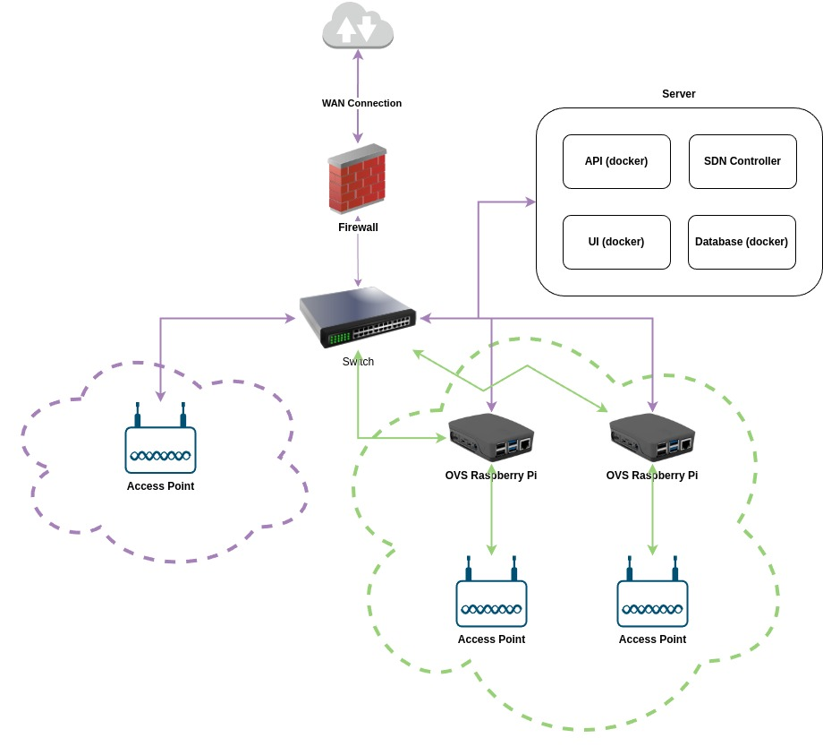

# Architecture

## Overview

This document presents the example network below and explains how the software will interact with the network.

This diagram represents a network that has been set up using the software. This process is detailed below.

This diagram represents a hybrid network. The purple network is a _standard_ network while the green network is an
OpenFlow-enabled (SDN) network.

Green arrows represent OpenFlow connections while purple represent traditional network connections

## Setting Up the Network
To set up a network with SDN Launch Control follow the steps below:
1. Set up devices as per the diagram above. A firewall is not necessary but a nice to have.
2. Download and run SDN Launch Control on your server.
3. Navigate to the switches page and click on `INSTALL OVS ON A SWITCH`.
4. Navigate to the controller page and click on `SET UP AN SDN CONTROLLER`.
5. Once you have a switch and controller set up, navigate to the switches page, select teh switch you want to connect to
the network and scroll to the `BRIDGE DETAILS` secrtion and select `ADD BRIDGE`.
6. On this form you will want to give the bridge a name (no spaces or special characters), provide the URL for you API
so if you are running this on your device you would provide your IP address in URL form with the port number, for example:
`http://10.10.10.10:8000` where you LAN IP address that can communicate with the switch is `10.10.10.10`. Then select
the ports you want to enable OpenFlow on, these ports should be the ones that connect back with your switch and then
connect to your access point, i.e. the green connections in the diagram. **NOTE** this should not be the port connected
to the switch that allows communication with the API, i.e. the purple line from the raspberry pi in the diagram.
7. Select the controller you just installed and then press `SUBMIT`.
8. Once this is complete you will have created a switch with a controller. You are almost ready to go but you need to
ensure the controller has some way of setting up your flow tables. A good example of this when using the ONOS would be 
to navigate to your ONOS UI and enable the Reactive Forwarding and OpenFlow applications.
9. Once your switch rules to forward traffic the network will function as expected.

## The Tech Stack

### Backend
The following services are run in docker containers
- Django
  - Celery
- Timescale Database
- Redis
- sFlow-RT

### Frontend
The following services are run in docker containers
- React (next.js)
- Nginx
